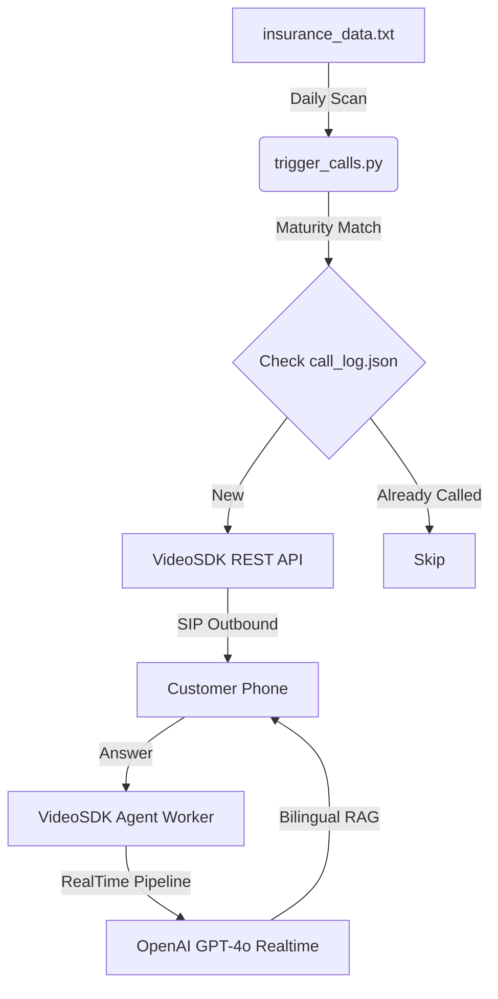

# 🛡️ AI Insurance Voice Agent: Technical Documentation

This project demonstrates a production-grade, outbound AI voice agent designed to automate insurance policy maturity notifications. It combines high-performance telephony with state-of-the-art Generative AI.

---

## 🏗️ Project Architecture & Flow



### **1. The Trigger (`trigger_calls.py`)**
- **Purpose**: Acts as the "Campaign Manager". It scans the flat-file database daily using Python's `datetime` logic.
- **State Selection**: Uses `call_log.json` to ensure "Idempotency" (meaning the system never calls the same policy twice even if restarted).
- **Communication**: Hits the VideoSDK `/sip/call` endpoint to initiate a professional SIP-to-PSTN call.

### **2. The Agent Brain (`main.py`)**
- **Unified Pipeline**: We used **OpenAI GPT-4o Realtime** instead of separate STT/TTS components. 
    - *Reasoning*: A unified WebSocket connection reduces "latency" (the awkward pause between speaking) from ~4 seconds to <1 second.
- **Bilingual RAG**: The system prompt injects real-time data from the text database. The agent is trained to match the user's language choice (Hindi or English) instantly.
- **Auto-Hangup**: Implemented a lifecycle listener on the `speech_out` event. When the "Goodbye" phrase is detected, it triggers a clean session shutdown.

---

## 🛠️ Tool Selection: "Why these tools?"

| Tool | Why we used it |
| :--- | :--- |
| **VideoSDK** | Best-in-class low-latency infrastructure for WebRTC and Telephony (SIP). It provides the "bridge" between the AI and the phone network. |
| **OpenAI GPT-4o Realtime** | The most advanced voice model currently available. It allows the agent to sound human, and handle interruptions and language switching natively. |
| **Python `videosdk-agents`** | The official toolkit for building persistent AI workers that can join and manage calls autonomously. |
| **Bilingual Prompting** | Ensures reachability across diverse demographics (Hindi-first customers and English-speaking users). |

---

## 📦 Installation & Setup

### **1. Requirements**
- Python 3.9+
- A valid VideoSDK API Key & Secret.
- An OpenAI API Key with usage credits.
- A Twilio/SIP provider connected to your VideoSDK Dashboard.

### **2. Installation Commands**
```bash
# Create a virtual environment
python -m venv venv
.\venv\Scripts\activate

# Install core dependencies
pip install videosdk-agents videosdk-plugins-openai python-dotenv requests
```

---

## 🏃 Operational Steps

### **Step 1: Configure Environment**
Ensure your `.env` contains all credentials. *Never share this file in public repositories.*

### **Step 2: Start the AI Worker**
The worker must be running to "hear" the incoming call assignments from VideoSDK.
```bash
python main.py
```

### **Step 3: Trigger the Campaign**
Run the trigger script to find today's maturing policies and start dialing.
```bash
python trigger_calls.py
```

---

## 🔒 Security & Scaling (Future Proofing)
- **Database**: For the demo, we use `.txt`. For production, this should be replaced with a SQL/NoSQL database (e.g., PostgreSQL or MongoDB).
- **Logging**: The `call_log.json` prevents duplicate dials. In production, use Redis for distributed state management.
- **Performance**: The agent currently handles 10 concurrent processes (set in `Options`). This can be scaled up by deploying the worker to a larger server (AWS EC2/Azure).
